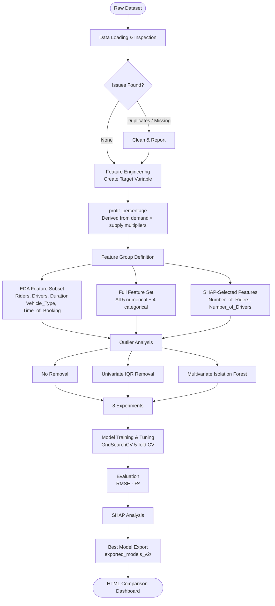

# Dynamic Surge Pricing — ML Modeling Pipeline

## Problem Statement

Our ride-sharing company currently sets fares based **only on ride duration**, using a fixed pricing rule that ignores real-time market conditions.

As a result, during peak hours (e.g., office closing time with heavy rain) this leads to:

- 🕐 Long waiting times for riders
- ❌ Ride cancellations
- 🚗 Inefficient driver allocation

## Overview
The backend is a FastAPI service that serves ML inference for:
- ride fare prediction
- profit percentage prediction

It loads pre-trained `.pkl` models from `backend/model/` and exposes prediction endpoints for the frontend.

## Tech Stack
- Python 3
- FastAPI + Uvicorn
- Pydantic (request/response validation)
- pandas (model input DataFrame shaping)
- scikit-learn models serialized with joblib
- CORS middleware for frontend integration

## Analysis Process (Modeling Workflow)
The modeling artifacts in `backend/model/` indicate an iterative experiment workflow:

1. Data exploration
- `EDA_Notebook.ipynb` used for univariate/multivariate inspection and feature understanding.

2. Feature and objective refinement
- `Modeling_Notebook_Adjusted_Cost.ipynb` used for experiment iteration and target/feature selection.
- `Modeling_Notebook_Profit_Percentage.ipynb` used for profit percentage experiment iteration and target/feature selection.
### End-to-End Pipeline




3. Experiment runs and model artifacts
- Multiple `exp*` models were generated and compared.
- Current API-selected models:
  - `exp1.6_shap_features.pkl` for fare prediction
  - `exp2.6_shap_features.pkl` for profit percentage prediction

4. Final serving features
- Fare prediction (`/predict`):
  - `Number_of_Riders`
  - `Number_of_Drivers`
  - `Expected_Ride_Duration`
- Profit prediction (`/predict-profit-percentages`):
  - `Number_of_Riders`
  - `Number_of_Drivers`

## API Endpoints
- `GET /`
  - Health/welcome message
- `POST /predict`
  - Predicts fare for one ride feature set
- `POST /predict-profit-percentages`
  - Batch predicts profit percentage for multiple rides

## Project Structure
```text
backend/
├── main.py
├── requirements.txt
├── vercel.json
├── README.md
├── __pycache__/
├── .venv/
└── model/
    ├── dynamic_pricing.csv
    ├── EDA_Notebook.ipynb
    ├── Modeling_Notebook_Adjusted_Cost.ipynb
    ├── exp1.6_shap_features.pkl
    ├── exp2.6_shap_features.pkl
    └── (other experiment model artifacts)
```

## Run Locally
```bash
cd backend
python3 -m venv .venv
source .venv/bin/activate
pip install -r requirements.txt
uvicorn main:app --reload --host 0.0.0.0 --port 8001
```